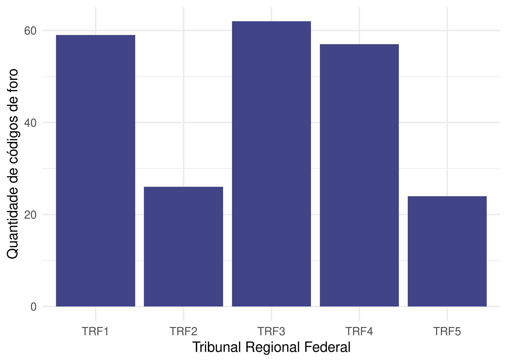

Foros CNJ
=========

O objetivo do `{forosCNJ}` é disponibilizar bases de dados e
documentação do projeto de levantamento das comarcas e códigos do
Brasil, considerando o disposto na [Resolução Nº 65/2008 do
CNJ](https://atos.cnj.jus.br/atos/detalhar/119), que trata da
uniformização do número dos processos nos órgãos do Poder Judiciário e
dá outras providências, favorecendo a consulta processual.

O número CNJ possui a estrutura NNNNNNN-DD.AAAA.J.TR.OOOO, composto por
seis campos obrigatórios.

Os dados foram coletados através dos anexos do [Conselho Nacional de
Justiça](https://www.cnj.jus.br/programas-e-acoes/numeracao-unica/documentos/).
Inclui-se Supremo Tribunal Federal, Conselho Nacional de Justiça,
Superior Tribunal de Justiça, Justiça Federal, Justiça do Trabalho,
Justiça Eleitoral, Justiça Militar da União, Justiça Estadual, Justiça
Militar Estadual.

Instalação
----------

A versão de desenvolvimento de `{forosCNJ}` pode ser instalada a partir
do código:

    devtools::install_github("abjur/forosCNJ")

Exemplos
--------

Segue abaixo alguns exemplos para o uso do pacote.

### Exemplo das Bases disponíveis

    library(forosCNJ)
    dplyr::glimpse(da_foro)
    #> Rows: 7,955
    #> Columns: 5
    #> $ id_justica  <chr> "8", "8", "8", "8", "8", "8", "8", "8", "8", "8", "8", "8…
    #> $ id_tribunal <chr> "26", "26", "26", "26", "26", "26", "26", "26", "26", "26…
    #> $ id_foro     <chr> "0000", "0001", "0002", "0003", "0004", "0005", "0006", "…
    #> $ comarca     <chr> "São Paulo", "São Paulo", "São Paulo", "São Paulo", "São …
    #> $ descricao   <chr> "Foro Unificado", "Foro Regional I - Santana", "Foro Regi…

### Exemplo de Tabela

    da_foro_comarca %>% 
      dplyr::arrange(comarca) %>% 
      dplyr::filter(id_justica == 8) %>% 
      dplyr::sample_n(10) %>% 
      knitr::kable()

| id\_justica | id\_tribunal | id\_foro | comarca            | descricao                        | sigla | uf  | ibge    |
|:------------|:-------------|:---------|:-------------------|:---------------------------------|:------|:----|:--------|
| 8           | 14           | 0089     | MELGACO            | Melgado                          | TJPA  | PA  | 1504505 |
| 8           | 11           | 0086     | NOVA MUTUM         | Comarca de Nova Mutum            | TJMT  | MT  | 5106224 |
| 8           | 15           | 9003     | JOAO PESSOA        | 3ª Turma Recursal de João Pessoa | TJPB  | PB  | 2507507 |
| 8           | 18           | 0068     | PORTO              | Porto                            | TJPI  | PI  | 2208502 |
| 8           | 15           | 0501     | SAO MAMEDE         | São Mamede                       | TJPB  | PB  | 2514909 |
| 8           | 06           | 0153     | QUIXELO            | Comarca de Quixelô               | TJCE  | CE  | 2311355 |
| 8           | 05           | 0117     | ITAGIBA            | Comarca de Itagibá               | TJBA  | BA  | 2915205 |
| 8           | 21           | 0056     | JULIO DE CASTILHOS | Foro de Julio Castilhos          | TJRS  | RS  | 4311205 |
| 8           | 12           | 0007     | CASSILANDIA        | Comarca de Cassilândia           | TJMS  | MS  | 5002902 |
| 8           | 06           | 0209     | POTENGI            | Comarca Vinculada de Potengi     | TJCE  | CE  | 2311207 |

### Exemplo de Gráfico

#### Gráfico de quantidade de Tribunais da Justiça federal por Siglas

    library(ggplot2)

    da_foro_comarca %>%
      dplyr::filter(id_justica == 4) %>% 
      ggplot() +
      geom_bar(aes(x = sigla), fill = viridis::viridis(1, 1, .2, .8)) +
      theme_minimal(14) +
      labs(
        x = "Tribunal Regional Federal", 
        y = "Quantidade de códigos de foro"
      )

